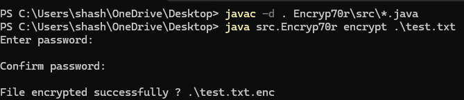
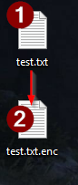
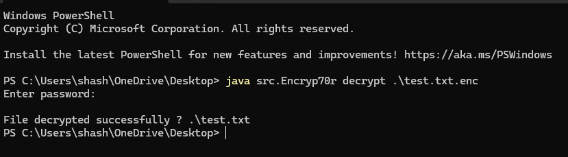
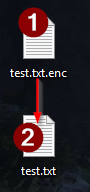
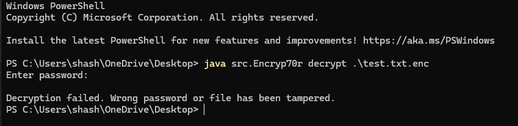

# 🔐 Encryp70r – Secure File Encryption Tool (Java)

A secure Java-based file encryption CLI tool implementing AES-256-GCM authenticated encryption and PBKDF2 key derivation.


## Overview
**Encryp70r** is a secure, password-based file encryption tool built in Java using modern cryptographic standards.

It allows encryption and decryption of **any file type** (documents, images, videos, executables, etc.) using strong authenticated encryption.  
The tool is terminal-based, lightweight, and cross-platform (Windows, Linux, macOS).

Designed using security-focused development practices such as strong key derivation, tamper detection, and safe password handling, Encryp70r ensures confidentiality and integrity of user data.

---
## 🎯 Motivation behind this tool
I built this tool to understand real-world cryptographic file protection and implement secure password-based encryption using modern Java cryptography practices.

---

## 🧩 Technical Highlights
- Implemented AES-256-GCM authenticated encryption
- Designed custom encrypted file format with header validation
- Implemented secure key derivation using PBKDF2
- Stream-based file encryption for large file support
- Built fully in Java using javax.crypto libraries


---


## 📸 Demo
Below are sample runs demonstrating encryption, decryption, and tamper detection.

### 🔐 Encryption Demo




### 🔓 Decryption Demo




### 🛡 Tamper Detection



---

## ✨ Features
- AES-256-GCM authenticated encryption  
- PBKDF2 (HmacSHA256) key derivation  
- Secure random salt and IV generation  
- Tamper detection and integrity protection  
- Streaming encryption (supports large files)  
- Hidden password input in terminal  
- No password storage  
- Cross-platform compatibility  
- Custom encrypted file format  

---

## 🧠 Cryptographic Design

### Encryption Algorithm
- **AES-256 in GCM mode**
- Provides confidentiality and integrity
- Detects tampering or wrong passwords automatically

### Key Derivation
- PBKDF2 with HmacSHA256  
- 100,000 iterations  
- 256-bit key length  
- Unique random salt per file  

### Encrypted File Format
Encrypted files follow this structure:

MAGIC | SALT | IV | ENCRYPTED_DATA


Where:
- `MAGIC` → File signature (`E70R`)
- `SALT` → 16 bytes
- `IV` → 12 bytes
- `ENCRYPTED_DATA` → Ciphertext with authentication tag

This ensures file validation, corruption detection, and secure decryption.

---

## 📂 Project Structure

```
src/
 ├── Encryp70r.java      # CLI entry point
 ├── CryptoEngine.java   # encryption/decryption logic
 ├── FileFormat.java     # encrypted file structure
 └── Utils.java          # secure password handling
```


---

## ⚙ Requirements
- Java JDK 11 or higher
- Terminal/command prompt (required for hidden password input)
- Works on Linux, Windows, macOS

Check Java:
java -version


---

## 🚀 How To Use

### 1. Clone Repository
`git clone https://github.com/CBSINHA/Encryp70r.git`


---

### 2. Compile

`javac -d . Encryp70r/src/*.java`


---

### 3. Encrypt a File
`java src.Encryp70r encrypt <file>`


You will be prompted to enter and confirm password securely.

Output:
file.enc


---

### 4. Decrypt a File
`java src.Encryp70r decrypt file.enc`


Output:
file


---

## 🛡 Security Practices
- Passwords are never stored
- Password cleared from memory after use
- Strong PBKDF2 key derivation with salt
- Random IV generated per encryption
- AES-GCM authentication prevents tampering
- Detects wrong password or corrupted files
- Prevents overwriting existing files

---

## ❗ Notes
- Must run from terminal (not IDE run button)
- Works for all file types
- Supports large files
- Encrypted files use `.enc` extension

---


## ⚠ Disclaimer
This tool is built for educational and personal file security purposes. 
Not intended for production-grade enterprise security use.

---

If you found this project interesting, feel free to ⭐ the repository.

---

## 👨‍💻 Author
**Shashank Sinha**  
